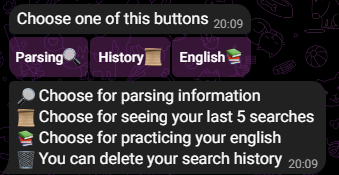
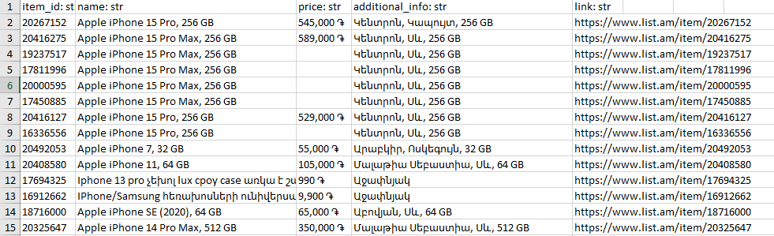
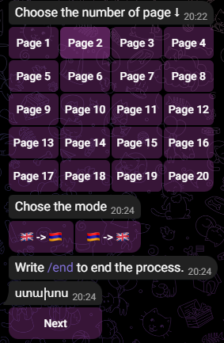

# Telegram Bot

---

This Telegram bot is built using the Aiogram framework in Python. It helps to study English words. It also has a scrapping
abiliti from 'https://www.list.am/' and returns the result as excel file. You can also see the history of searches.

## Prerequisites

Before running the Telegram bot, make sure you have the following prerequisites installed and configured:

- **Python 3.x:** Ensure you have Python 3.x installed on your machine.

- **Required Python packages:** Aiogram, requests, beautifulsoup4, pandas, openpyxl, sqlite3

## Start
After clicking the `START` button or typing `/start`, you will see it.

Then click `/run` to see the menu

## Menu
* Parsing
* History
* Englsih

Every button is responsible for its function

## Parsing

After clicking the "Parsing" button, it will prompt the user with the text:
`Write item name for parsing`.The bot will then wait until the user inputs the name of the item.

#### Result

For example, if the user inputs `Iphone`, the bot will return:

The input `Iphone` will be saved in the parsing history.

## History

History button will return the last 5 items of parsing.

## English

After clicking, the bot will provide 20 buttons corresponding to pages. Each page contains approximately 30-40 words.
And after that, you can choose the mode, and it will give the random word from page.

## Additional Commands

Also, here are additional commands for starting, menu, and deleting history.

